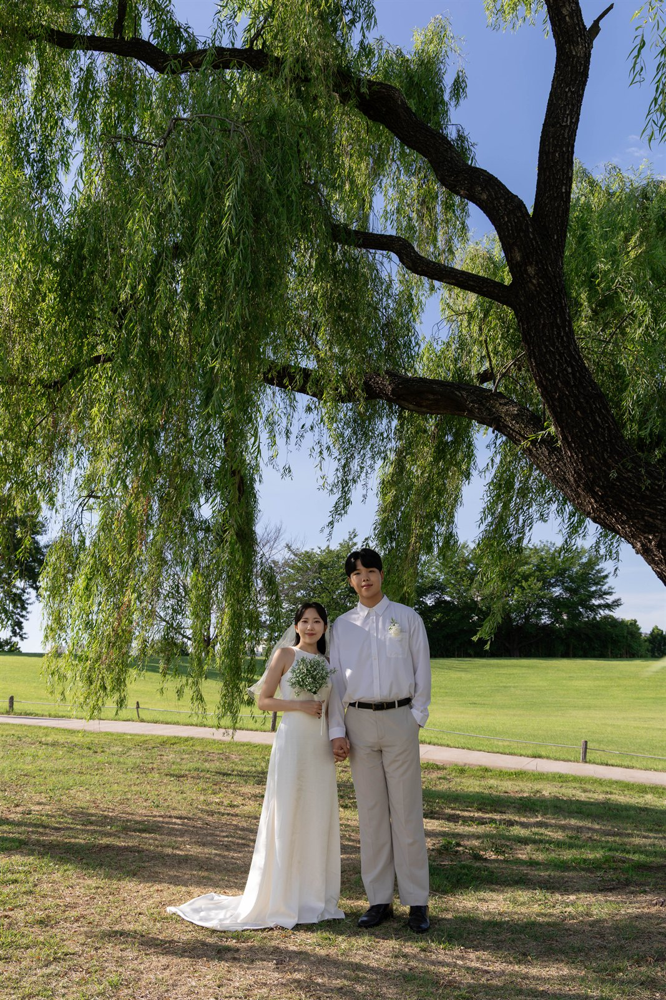

# 성훈 ♥ 나영 청첩장

순수 HTML/CSS/JS로 만든 모바일 청첩장입니다. GitHub Pages에 바로 올려서 쓸 수 있어요.

## 폴더 구조
```
wedding-invitation/
├── index.html   ← 모든 텍스트/구조
├── style.css    ← 디자인
├── script.js    ← 카운트다운, 갤러리, 공유 등 기능
└── images/      ← 실제 사진을 여기에 넣으세요 (지금은 비어있음)
```

## 1. GitHub Pages에 올리는 방법

1. GitHub에서 새 저장소 생성 (예: `my-wedding`)
2. 이 폴더 안의 파일들을 저장소 루트에 push
   ```bash
   git init
   git add .
   git commit -m "청첩장 초기 버전"
   git branch -M main
   git remote add origin https://github.com/내아이디/my-wedding.git
   git push -u origin main
   ```
3. GitHub 저장소 → Settings → Pages → Source를 `main` 브랜치로 설정
4. 몇 분 후 `https://내아이디.github.io/my-wedding/` 로 접속 가능

## 2. 지금 당장 해야 할 것 (placeholder → 실제 내용)

### 사진 교체
지금은 모든 사진이 점선 박스 placeholder예요. 실제 사진 준비되면:
- `images/` 폴더에 사진 파일들을 넣고
- `index.html`에서 `<div class="img-placeholder ...">` 부분을 아래처럼 `` 태그로 교체
  ```html
  <!-- 변경 전 -->
  <div class="img-placeholder hero-img"><span>메인 사진 교체 위치</span></div>
  <!-- 변경 후 -->
  
  ```
- 갤러리(`script.js`의 `initGallery()` 함수)는 9개를 자동 생성하는 방식이라, 실제 사진 9장이 준비되면 이 함수를 지우고 `index.html`의 `#gallery` 안에 `` 9개를 직접 넣는 게 더 간단해요.

### RSVP / 방명록 폼 연결
GitHub Pages는 정적 파일만 서빙하기 때문에 서버 저장(DB)이 불가능해요. 대신 구글폼을 추천드려요.
1. forms.google.com 에서 새 양식 만들기 (성함, 참석여부, 인원 등 질문 추가)
2. 만든 폼의 공유 링크를 복사
3. `script.js` 상단의 `RSVP_FORM_URL`, `GUESTBOOK_FORM_URL` 값에 붙여넣기

### 전화번호 / 계좌번호
`index.html`에서 `010-0000-0000`, 계좌번호 등을 실제 값으로 검색-교체(Ctrl+H) 하세요.

### 카카오톡 공유 미리보기 이미지
`index.html` 상단의 `<meta property="og:image" content="images/og-main.jpg">` 경로에 실제 사진을 넣어주세요. (가로형 이미지 권장)

## 3. 나중에 고려해볼 것
- 지도는 API 키 없이 "검색 URL" 방식(네이버/카카오/구글)으로 연결해뒀어요. 정확한 핀 위치가 필요하면 각 지도 서비스의 개발자센터에서 API 키를 발급받아 추가 연동할 수 있어요.
- 카카오톡 "공유" 버튼은 지금 브라우저 기본 공유(Web Share API) + 링크 복사로 되어있어요. 카카오 개발자 계정이 있으면 카카오 SDK로 더 예쁜 카톡 공유 카드로 업그레이드할 수 있어요.
